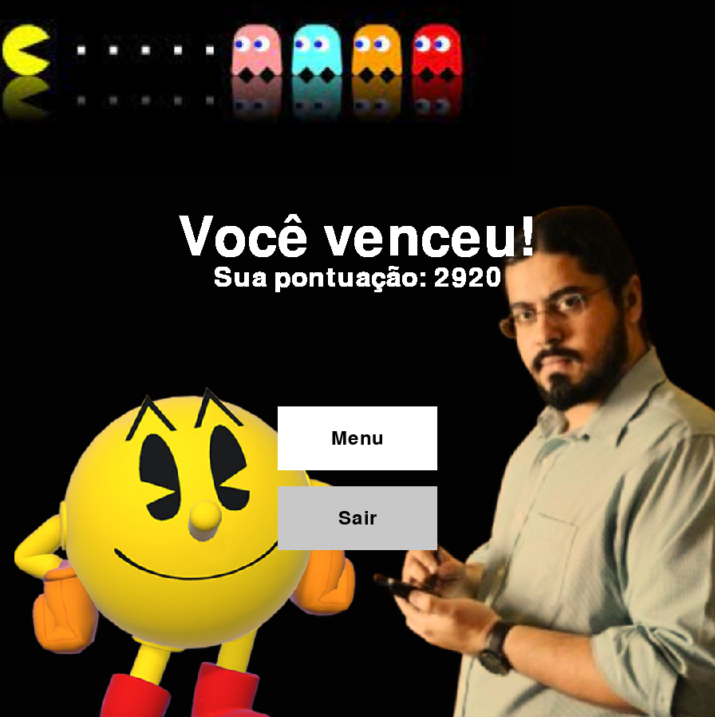
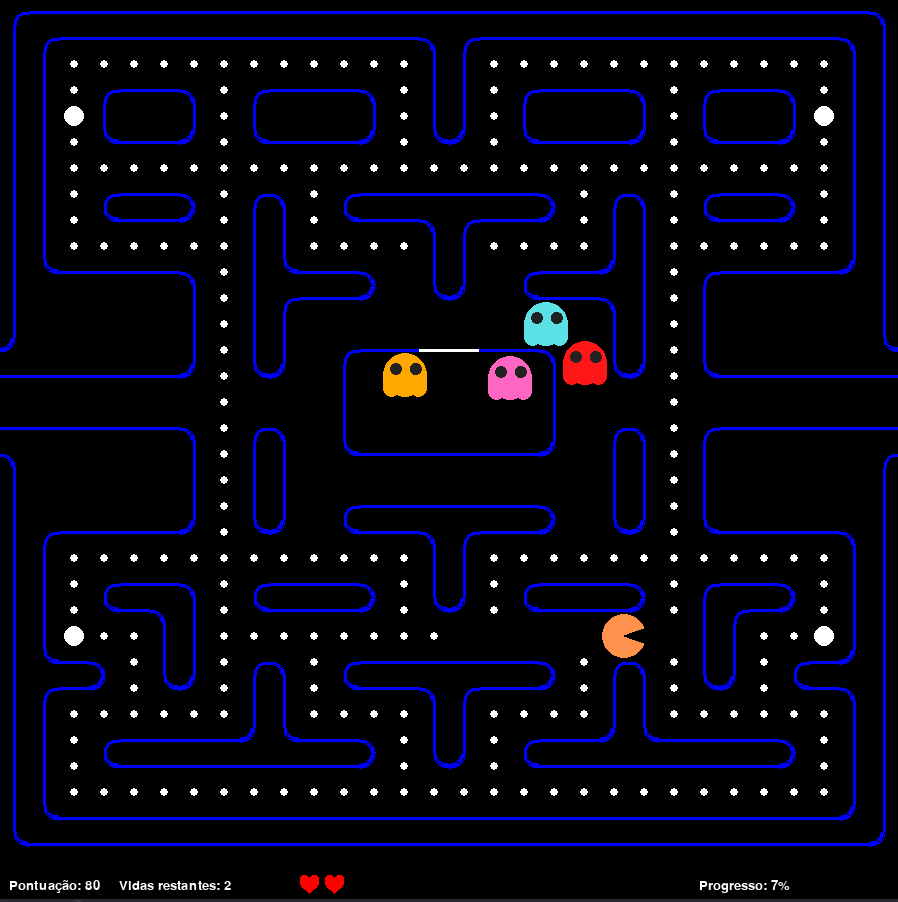
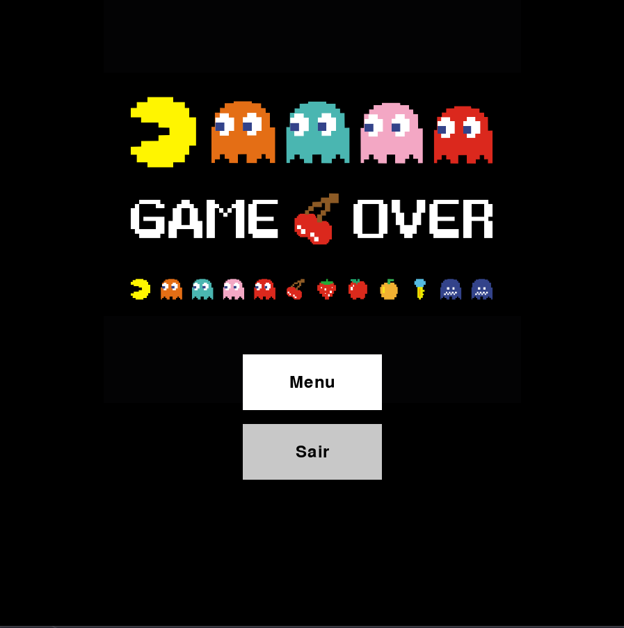

# Jogo PacMan em Python com Pygame (Trabalho A2 - Linguagens de Programação)

### Membros: João Pedro Tambosi, João Felipe Vilas Boas, Esdras Cavalcanti, Marcelo Ângelo, e Vitor Palmeira.

Bem-vindo à nossa replica do jogo PacMan, desenvolvido em Python com Pygame e utilizando uma abordagem robusta de Orientação a Objetos.

## Visão Geral

Este jogo PacMan foi criado como parte de um projeto que destaca as melhores práticas de programação, enfatizando a modularidade e a clareza do código. A estrutura do código foi cuidadosamente organizada usando princípios de Orientação a Objetos, o que facilita a manutenção, expansão e compreensão do código.

## Tecnologias Utilizadas

- **Python**: A linguagem de programação principal.
- **Pygame**: Uma biblioteca poderosa para desenvolvimento de jogos em Python, oferecendo recursos gráficos e de áudio.
- **Orientação a Objetos**: Uma abordagem eficaz para organizar o código em componentes reutilizáveis e compreensíveis.

## Screenshots

  

## Funcionalidades Principais

- **PacMan e Fantasmas**: Implementação dos personagens principais. O PacMan sendo controlados pelas teclas "WASD" e os fantasmas com algoritmos próprios de perseguição.
- **UI interativo**: Telas de menu, Game Over e "You Won" indicando resultados do jogo.
- **Labirinto idêntico ao do jogo original**: Criação de um labirinto que desafia os jogadores.
- **Pontuação, vidas restantes e progresso**: indicamos 3 métricas durante o jogo na barra inferior: pontuação total (cada fantasma comido vale 100, cada ponto vale 10 e cada fruta vale 50), progresso total da fase e vidas restantes (o jogador tem 4 vidas).

## Como Executar

1. **Instale as Dependências**: Certifique-se de ter o Python e o Pygame instalados. Você pode instalar o Pygame usando o seguinte comando:

   ```bash
   pip install -r requirements.txt
   ```

2. **Clone o Repositório**: Clone este repositório em seu ambiente local usando:

   ```bash
   git clone https://github.com/wobetec/trabalho-A2-LP.git
   ```

3. **Execute o Jogo**: Navegue até o diretório do projeto (`src`) e execute o jogo usando:
   ```bash
   python game.py
   ```

## Contribuições

Contribuições são bem-vindas! Se você tiver sugestões para melhorias, correções de bugs ou novas funcionalidades, sinta-se à vontade para abrir uma issue ou enviar um pull request.

# Documentação do Trabalho

A documentação do nosso trabalho e elaboração sobre módulo utilizados pode ser encontrada no seguinte link: [documentação](https://trabalho-a2-lp.readthedocs.io/pt/latest/)

# Agradecimentos

Os assets bem como a matemática básica por trás do movimento dos fantasmas foi extraída do seguinte link: [plemaster01](https://github.com/plemaster01/PythonPacman).

A Trilha sonora utilizada nas animações e demais momentos do jogo foi retirado do seguinte link: [classicgaming](https://www.classicgaming.cc/classics/pac-man/sounds)
